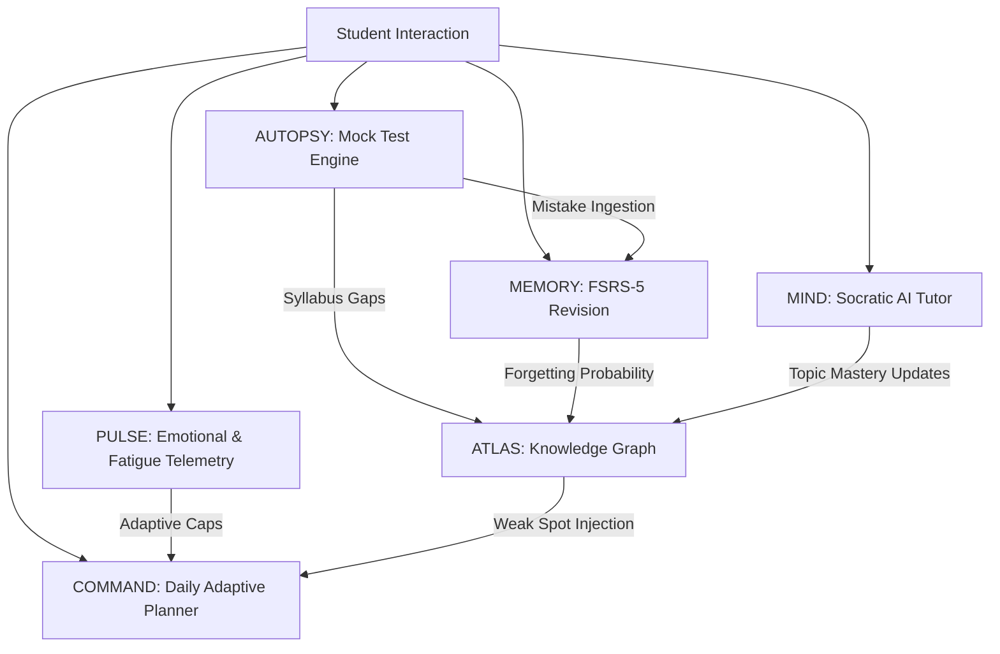
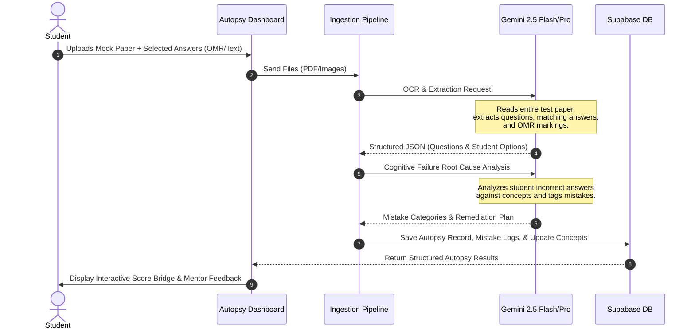
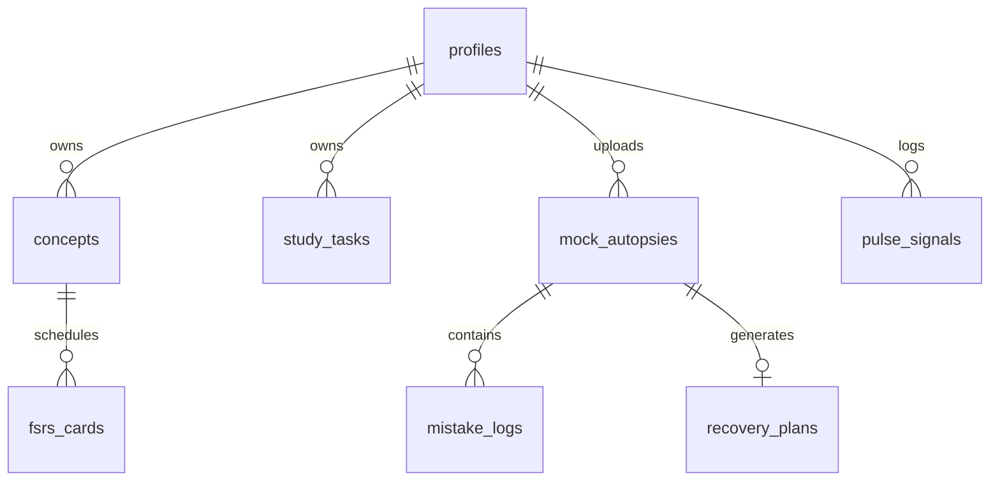
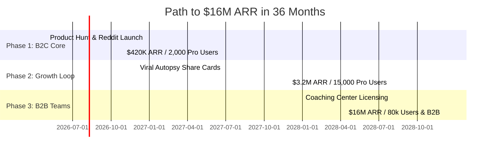

# Cognition OS — Full Product Vision & Comprehensive Specification

## 1. Executive Summary & Core Philosophy

### The Learning Crisis of Fragmentation
Every serious student preparing for competitive exams (NEET, JEE, SAT, UPSC, etc.) is currently acting as their own systems integrator. They juggle 6–7 disconnected tools:
*   **YouTube / Courses** for lectures
*   **ChatGPT / Doubts Apps** for query resolution
*   **Anki / Quizlet** for flashcard-based active recall
*   **Notion / physical notebooks** for notes
*   **Coaching PDFs / printed test series** for mock tests
*   **Excel sheets** for tracking marks and mistake logs

None of these tools communicate with each other. None of them understand the full cognitive and psychological profile of the student. None of them know what the student is struggling with in real-time, what their forgetting curve looks like, or how their mental stamina is holding up under exam pressure.

### The Unified Solution: Cognition OS
**Cognition OS** is the world's first AI-native student operating system. It consolidates the fragmented learning stack into a single, cohesive, offline-resilient, intelligence-guided platform. It doesn't just track metrics; it actively coaches the student, adapts to their fatigue level, curates their daily tasks, schedules their revisions using state-of-the-art cognitive algorithms, and conducts comprehensive autopsies on their mock tests.



---

## 2. The Six Core Subsystems

Cognition OS is engineered around six interconnected cognitive layers:

### I. MIND — The Socratic AI Tutor
Unlike standard LLM wrappers that simply spit out direct answers, MIND operates as a Socratic tutor.
*   **Active Recall Injection:** Instead of solving a physics problem for a student, MIND guides them step-by-step, asking clarifying questions to identify exactly where the conceptual breakdown occurs.
*   **Longitudinal Contextualization:** It references the student's past mistakes: *"Remember that mistake you made on centrifugal force in Mock Test 3? We are seeing the same mistake pattern here. Let's resolve it."*

### II. COMMAND — The Dynamic Planner
The ultimate daily operations system for learning.
*   **Zero-Overload Planning:** Takes inputs from ATLAS (weakest chapters), MEMORY (FSRS cards due), and PULSE (fatigue levels) to auto-generate a realistic, bite-sized daily checklist.
*   **Overnight Cron Synthesis:** Synthesizes the previous day's performance and generates a "Morning Briefing" specifying the critical path to score improvement.

### III. AUTOPSY — The Mock Test Autopsy Engine
The premium diagnostic engine that transforms mock test failures into motivational breakthroughs.
*   **Visual & PDF Ingestion:** Students upload paper PDFs, OMR sheets, or photo uploads.
*   **The Mark-Loss Breakdown:** Classifies every single wrong answer into a precise cognitive failure mode (Conceptual, Silly, Time Pressure, Reading Error).
*   **The Recoverable Score:** Displays a premium neon-accented bridge showing:
    $$\text{Actual Score} \rightarrow \text{Recoverable Score} \rightarrow \text{Potential Score}$$

### IV. ATLAS — The Interactive Knowledge Graph
A real-time, dynamic map of the student's mastery across their entire syllabus.
*   **Granular Node Mapping:** Divides subjects into Chapters, Topics, and micro-Concepts.
*   **Forgetting Heatmap:** Nodes shift color dynamically from Cyan (Automated recall) to Red (Critical danger of forgetting) based on FSRS calculations and recent mock performance.

### V. MEMORY — FSRS-5 Revision Engine
Adaptive active recall powered by the modern Free Spaced Repetition Scheduler (FSRS-5) algorithm.
*   **Compounding Memory:** Evaluates memory parameters (retrievability, stability, difficulty) on every flashcard interaction.
*   **Mistake-to-Card Pipeline:** Concepts missed during an AUTOPSY are instantly turned into active-recall flashcards and scheduled for spacing.

### VI. PULSE — Emotional & Fatigue Telemetry
The psychological governor of the operating system.
*   **Behavioral Tracking:** Detects studying speed, mouse/touch jitter, session duration, and self-reported emotional states.
*   **Adaptive Workload Caps:** If PULSE detects high stress or burnout, it automatically reduces the daily task cap, schedules breaks, and shifts the Socratic tutor's tone to supportive empathy.

---

## 3. The Mock Test Autopsy: Deep Dive

### Step-by-Step Processing Flow



### Cognitive Mistake Taxonomy
Every mistake logged in the AUTOPSY engine is tagged with one of nine primary cognitive failure categories, stored as `mistake_category` in the database:
1.  **Conceptual Loophole (`conceptual`):** Student does not understand the underlying physics/chemistry principle.
2.  **Calculation Error (`calculation`):** The algebra, arithmetic, or integration was incorrect despite correct setup.
3.  **Reading Misdirection (`reading`):** Student missed words like "NOT", "INCORRECT", "EXCEPT".
4.  **OMR Bubbling Slip (`omr_bubble`):** Correctly solved on scratch paper, but filled in the wrong circle.
5.  **Time Panic (`time_pressure`):** Guessed or rushed due to a ticking timer or lack of time management.
6.  **Formula Slip (`formula`):** Misremembered a constant or sign in a formula.
7.  **Overthinking/Underthinking (`overthinking`):** Second-guessed a correct choice or fell for a distractor option.
8.  **Silly Distraction (`silly`):** General focus slip on an extremely easy problem.
9.  **Stamina Failure (`fatigue`):** Mistake made in the final 15% of the test duration due to mental exhaustion.

---

## 4. Retentive Design & Socratic Mentor Psychology

To keep students addicted to improvement, Cognition OS implements **Actionable Empathy** and a dynamic **Praise/Roast Mentor Cycle**.

### The praise_roast_cycle
Every time an autopsy is completed or a study session ends, the AI Mentor evaluates the student's metrics and adopts a psychometrically tuned persona.

#### The Supportive Praise (When student improves or shows extreme grit)
*   **Psychology:** Reinforces system 2 thinking, emphasizes effort over raw talent, and highlights cumulative streaks.
*   **Example Output:**
    > *"I saw how you pushed through that final organic chemistry set at 11:30 PM. Your accuracy dropped on the last 3 questions due to fatigue (PULSE registered a 78% fatigue index), but your grit score is in the 99th percentile of serious JEE candidates today. Your potential score is now 240. Let's sleep, recover, and capture those 12 marks tomorrow."*

#### The Brutal Roast (When student makes silly mistakes due to rushing or laziness)
*   **Psychology:** A friendly but razor-sharp reminder that NEET/JEE is won on precision, designed to shock the student out of complacency.
*   **Example Output:**
    > *"You scored a 580 on this mock, but let's be honest — 32 marks were literally donated to the examiner. Bubbling option B when you calculated A? Rushing a simple kinematics calculation like it's a speedrun? Your brain was awake, but your focus was on vacation. Stop donating marks. You are better than this."*

---

## 5. Technical Architecture & Database

### The Premium Tech Stack
*   **Frontend Framework:** Next.js 16 (App Router) utilizing Turbopack for lightning-fast hot reloading.
*   **Database & Auth:** Supabase (PostgreSQL) for secure, low-latency data storage, Edge Auth, and row-level security.
*   **Semantic Search & RAG:** `pgvector` extension for storing embedding chunks of student materials directly inside the PostgreSQL database.
*   **Spaced Repetition Scheduler:** FSRS-5 algorithm implemented using `ts-fsrs` with custom parameter tuning for rapid cognitive load.
*   **AI Engines:** Gemini 2.5 Flash for rapid, high-context visual OCR processing; Gemini 2.5 Pro for deep multi-concept Socratic reasoning and planner synthesis.

### Database Schema Specification (18 Tables)



#### 1. `profiles`
Tracks user details, target exams, target scores, and active emotional state telemetry.
```sql
CREATE TABLE profiles (
  id UUID PRIMARY KEY DEFAULT gen_random_uuid(),
  email TEXT UNIQUE NOT NULL,
  full_name TEXT,
  exam_type TEXT NOT NULL, -- 'NEET', 'JEE', 'SAT', 'UPSC', 'CUSTOM'
  target_year INTEGER NOT NULL,
  target_score INTEGER,
  daily_study_target_hours REAL DEFAULT 8.0,
  streak_days INTEGER DEFAULT 0,
  emotional_state TEXT DEFAULT 'neutral', -- 'focused', 'stressed', 'burnt_out', etc.
  onboarding_complete BOOLEAN DEFAULT false,
  created_at TIMESTAMP WITH TIME ZONE DEFAULT now()
);
```

#### 2. `concepts`
Maps individual chapters and topics to construct the student's personal ATLAS knowledge graph.
```sql
CREATE TABLE concepts (
  id UUID PRIMARY KEY DEFAULT gen_random_uuid(),
  user_id UUID REFERENCES profiles(id) ON DELETE CASCADE,
  name TEXT NOT NULL,
  subject TEXT NOT NULL,
  chapter TEXT NOT NULL,
  topic TEXT,
  mastery TEXT DEFAULT 'not_started', -- 'not_started', 'exposed', 'developing', 'proficient', 'mastered', 'automated'
  confidence TEXT DEFAULT 'low',
  times_reviewed INTEGER DEFAULT 0,
  times_correct INTEGER DEFAULT 0,
  forgetting_probability REAL DEFAULT 0.0,
  last_reviewed_at TIMESTAMP WITH TIME ZONE,
  created_at TIMESTAMP WITH TIME ZONE DEFAULT now()
);
```

#### 3. `fsrs_cards`
Schedules memory card retention metrics based on the FSRS-5 algorithm.
```sql
CREATE TABLE fsrs_cards (
  id UUID PRIMARY KEY DEFAULT gen_random_uuid(),
  user_id UUID REFERENCES profiles(id) ON DELETE CASCADE,
  concept_id UUID REFERENCES concepts(id) ON DELETE CASCADE,
  front TEXT NOT NULL,
  back TEXT NOT NULL,
  stability REAL NOT NULL,
  difficulty REAL NOT NULL,
  lapses INTEGER DEFAULT 0,
  state INTEGER DEFAULT 0, -- 0: New, 1: Learning, 2: Review, 3: Relearning
  last_review TIMESTAMP WITH TIME ZONE,
  next_review TIMESTAMP WITH TIME ZONE NOT NULL,
  created_at TIMESTAMP WITH TIME ZONE DEFAULT now()
);
```

#### 4. `mock_autopsies`
The core repository of uploaded mock exams, containing detailed performance profiles.
```sql
CREATE TABLE mock_autopsies (
  id UUID PRIMARY KEY DEFAULT gen_random_uuid(),
  user_id UUID REFERENCES profiles(id) ON DELETE CASCADE,
  test_name TEXT NOT NULL,
  total_marks INTEGER NOT NULL,
  actual_score INTEGER NOT NULL,
  potential_score INTEGER NOT NULL,
  recoverable_marks INTEGER NOT NULL,
  ocr_raw_text TEXT,
  mentor_quote TEXT,
  praise_roast_tag TEXT,
  created_at TIMESTAMP WITH TIME ZONE DEFAULT now()
);
```

#### 5. `mistake_logs`
Granular registry of incorrect responses mapped to cognitive failure reasons.
```sql
CREATE TABLE mistake_logs (
  id UUID PRIMARY KEY DEFAULT gen_random_uuid(),
  autopsy_id UUID REFERENCES mock_autopsies(id) ON DELETE CASCADE,
  user_id UUID REFERENCES profiles(id) ON DELETE CASCADE,
  question_number INTEGER NOT NULL,
  subject TEXT NOT NULL,
  chapter TEXT NOT NULL,
  concept_name TEXT,
  student_option TEXT,
  correct_option TEXT,
  mistake_category TEXT NOT NULL, -- 'conceptual', 'silly', 'time_pressure', etc.
  cognitive_reason TEXT,
  remediation_step TEXT,
  created_at TIMESTAMP WITH TIME ZONE DEFAULT now()
);
```

#### 6. `recovery_plans`
Actionable study blueprints generated dynamically after mock autopsies.
```sql
CREATE TABLE recovery_plans (
  id UUID PRIMARY KEY DEFAULT gen_random_uuid(),
  autopsy_id UUID REFERENCES mock_autopsies(id) ON DELETE CASCADE,
  title TEXT NOT NULL,
  expected_marks_gain INTEGER NOT NULL,
  estimated_minutes INTEGER NOT NULL,
  tasks JSONB NOT NULL, -- Array of daily review actions
  is_completed BOOLEAN DEFAULT false
);
```

#### 7. `pulse_signals`
Tracks behavioral, speed, and accuracy patterns to assess student well-being.
```sql
CREATE TABLE pulse_signals (
  id UUID PRIMARY KEY DEFAULT gen_random_uuid(),
  user_id UUID REFERENCES profiles(id) ON DELETE CASCADE,
  signal_type TEXT NOT NULL, -- 'self_report', 'session_pattern', 'performance_trend'
  emotional_state TEXT NOT NULL,
  confidence REAL DEFAULT 0.5,
  session_duration_minutes INTEGER,
  recent_accuracy REAL,
  interaction_count INTEGER,
  notes TEXT,
  created_at TIMESTAMP WITH TIME ZONE DEFAULT now()
);
```

---

## 6. Business Plan & Growth Mechanics

### Monetization Blueprint
Cognition OS operates a compounding freemium subscription model:

| Tier | Price | Features Included |
|---|---|---|
| **Free / Freemium** | $0 | 2 Mock Autopsies per month, core daily planner, basic study stats |
| **Pro Plan** | **$19/month** or **$149/year** | Unlimited Mock Autopsies, full pgvector RAG document context, adaptive Socratic MIND tutor, deep PULSE telemetry adjustment |
| **Teams Plan (Institutes)** | **$49/student/year** | Institutional dashboard, teacher-led RAG class material distribution, aggregate syllabus bottleneck reports |

### $16M ARR Financial Trajectory (Year 1 - Year 3)



### Compounding Competitive Moats
1.  **High-Fidelity Longitudinal Data:** The longer a student studies, the more precise the ATLAS and PULSE models become. Switching tools would mean erasing months of highly customized memory optimization.
2.  **Viral Content Flywheel:** The **Autopsy Share Card** bridges student score gains with social sharing: *"I recovered +48 marks on my NEET mock test using Cognition OS."* This generates organic, zero-CAC signups.
3.  **Institutional Lock-in:** Coaching centers cannot replicate the unified Socratic mentoring experience with standard administrative tools. Once an institute adopts Cognition Teams, their entire student base is standardized on the platform.
